# Практическая работа №6: Отладка приложений. Использование Logcat и таймеров

**Выполнил:**  
Саньков Андрей Александрович  
Группа: ИНС-б-о-24-1  
Направление: 09.03.02 «Информационные системы и технологии»

---

## Цель работы

Изучить инструменты отладки Android-приложений. Научиться использовать Logcat для логирования сообщений различных уровней, а также применять таймеры (Timer, Chronometer) для выполнения отсроченных и периодических задач.

---

## Ход работы

### Задание 1. Знакомство с Logcat

Создан проект DebuggingLab. В методе onCreate() добавлены сообщения с разными уровнями логирования (`Log.v()`, `Log.d()`, `Log.i()`, `Log.w()`, `Log.e()`), включая обработку искусственного исключения. Запущено приложение, в окне Logcat найдены сообщения, опробована фильтрация по уровню, тегу и тексту.

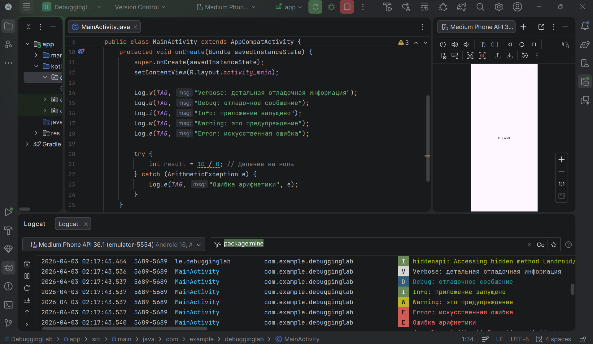

**Рисунок 1** — Вывод сообщений в Logcat

---

### Задание 2. Использование точек останова

Установлена точка останова на строке с Log.d(). Приложение запущено в режиме отладки (Debug). Выполнение остановилось, использованы кнопки Step Over, изучена панель Variables, продолжено выполнение.

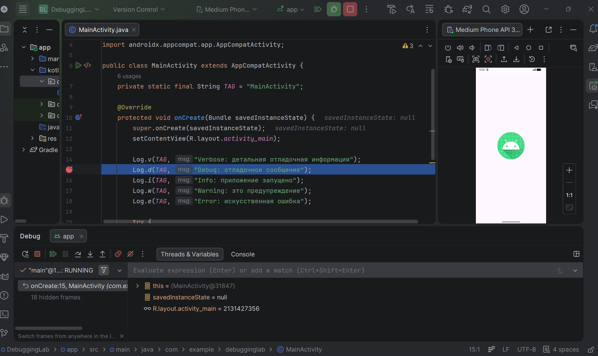

**Рисунок 2** — Отладка с точкой останова 

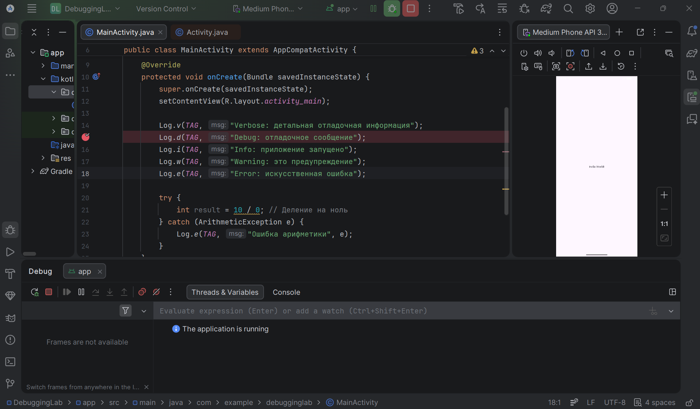

**Рисунок 3** — Продолжение выполнения программы до конца (Rresume program f9)

---

### Задание 3. Работа с Timer (отложенное выполнение)

В activity_main.xml добавлены TextView и кнопка «Запустить таймер». При нажатии на кнопку запускается Timer, который через 5 секунд изменяет текст в `extView. Обновление UI выполнено через `runOnUiThread()`, так как TimerTask работает в фоновом потоке.

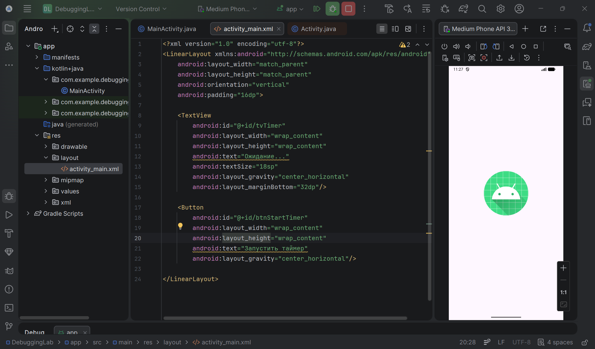

**Рисунок 4** — Создание разметки для таймера в activity_main.xml

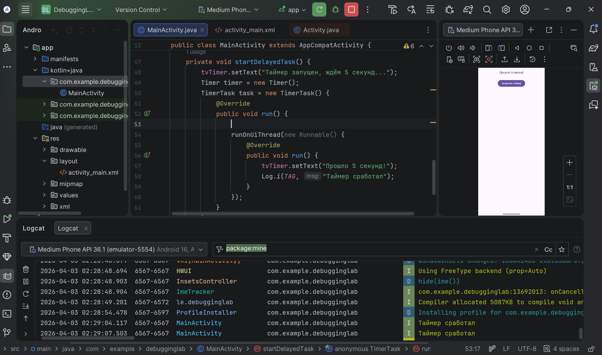

**Рисунок 5** — Добавление логики таймера в MainActivity

---

### Задание 4. Создание секундомера с Chronometer

Добавлена новая StopwatchActivity с разметкой, содержащей Chronometer и три кнопки: «Старт», «Стоп», «Сброс». Реализована логика запуска, остановки и сброса секундомера. В MainActivity добавлена кнопка перехода к секундомеру.

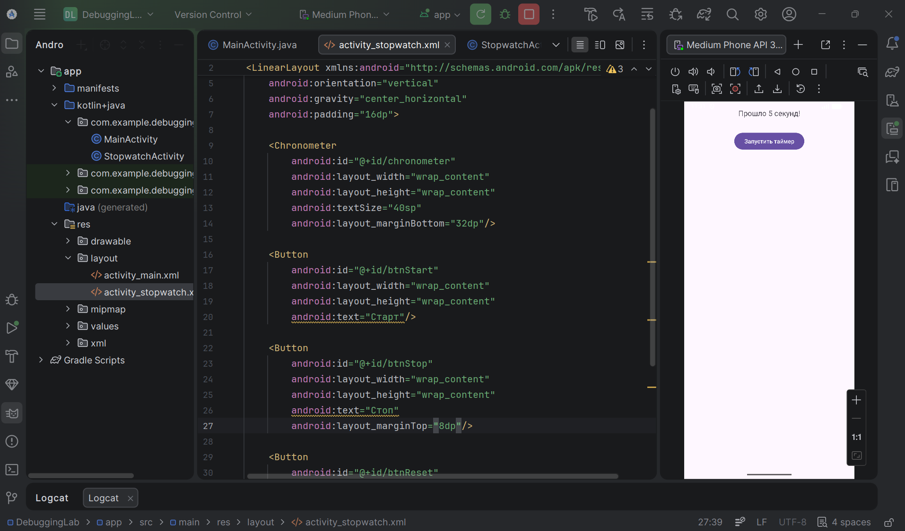

**Рисунок 6** — Cоздание разметки для секундомера

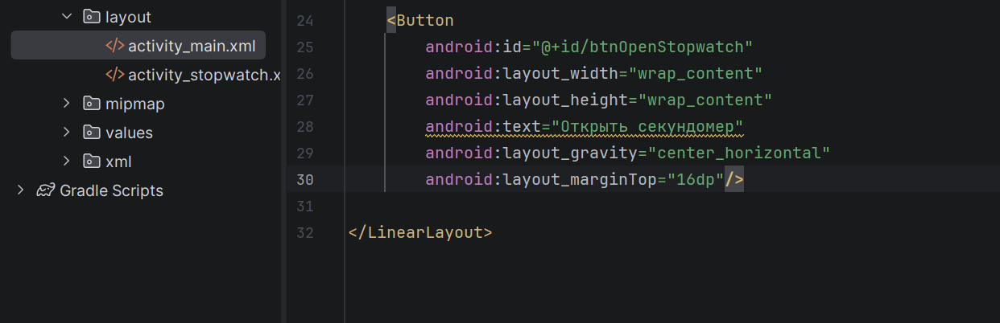

**Рисунок 7** — Cоздание кнопки для открытия вкладки "секундомер" в activity_main.xml

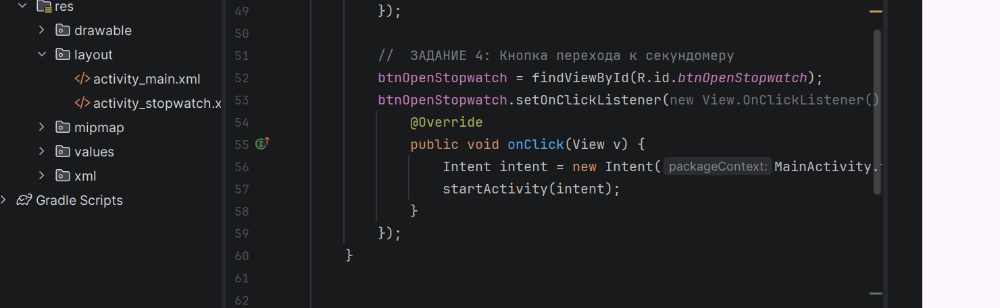

**Рисунок 8** — Обработчик кнопки "Cекундомер" 

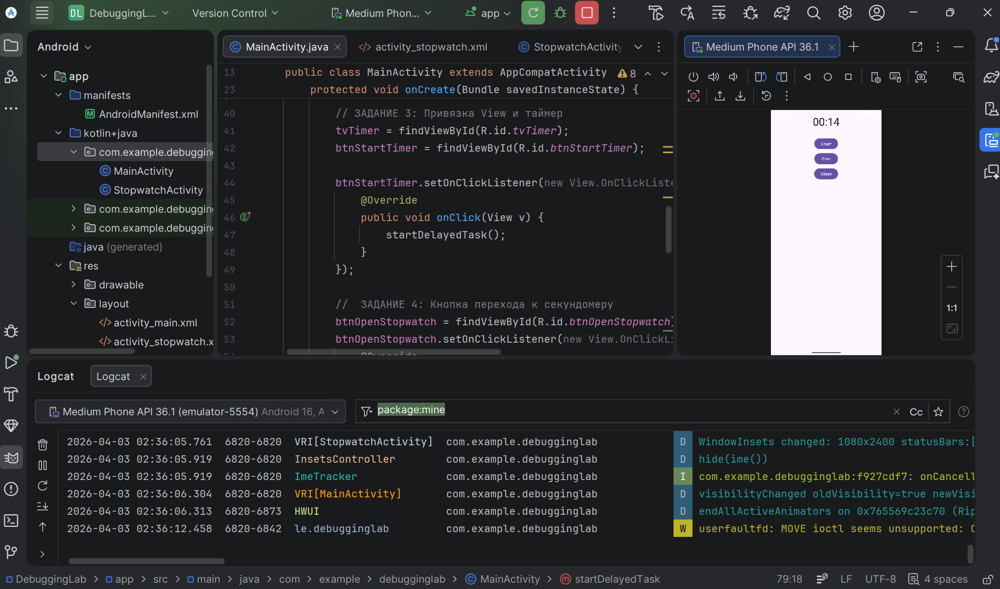

**Рисунок 9** — Секундомер в работе

---

## Задания для самостоятельного выполнения

Выбран **вариант 10: сумма простых чисел**. Функция F (вариант 10). x от -30 до 30 с шагом 1 в секунду.
F = { ax² - bx + c, при x < 3 и b ≠ 0; (x - a)/(x - c), при x > 3 и b = 0; -x/c в остальных случаях }

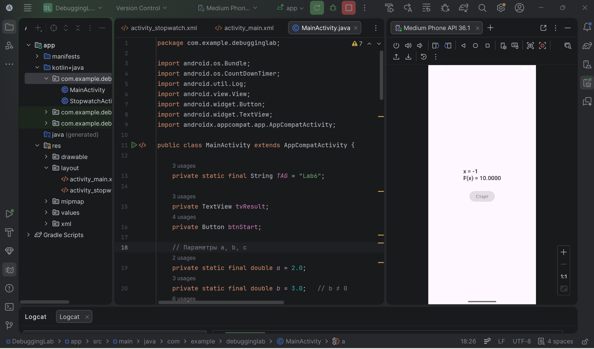

**Рисунок 10** — Отображение текущей суммы

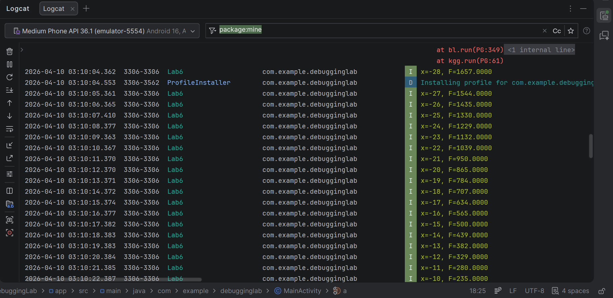

**Рисунок 11** — Логи в Logcat (тег Lab6)

---

## Контрольные вопросы

### 1. Какие уровни логирования существуют в Android? Для каких целей используется каждый из них?

- `Log.v()` — Verbose (подробный), для самой детальной отладочной информации.
- `Log.d()` — Debug (отладка), для сообщений, полезных при отладке.
- `Log.i()` — Info (информация), для сообщений о нормальной работе приложения.
- `Log.w()` — Warning (предупреждение), для потенциально опасных ситуаций.
- `Log.e()` — Error (ошибка), для сообщений об ошибках.

---

### 2. Как открыть окно Logcat в Android Studio? Как отфильтровать сообщения только по тегу и только по уровню Error?

Logcat открывается через `View → Tool Windows → Logcat`. Для фильтрации по тегу нужно ввести тег в строку поиска или выбрать `Edit Filter Configuration` и указать тег. Для фильтрации по уровню Error — выбрать соответствующий уровень в выпадающем списке (обычно рядом с поиском).

---

### 3. В чем разница между методами Log.e() и Log.w()? Приведите примеры использования.

- `Log.e()` используется для сообщений об ошибках, которые нарушают работу приложения (например, исключение).
- `Log.w()` используется для предупреждений, которые не критичны, но могут указывать на потенциальную проблему (например, использование устаревшего API).  
Пример: `Log.w(TAG, "Память на исходе")`, `Log.e(TAG, "Не удалось открыть файл", exception)`.

---

### 4. Что такое точка останова (breakpoint)? Как запустить приложение в режиме отладки?

Точка останова — это специальная метка в коде, при достижении которой выполнение приложения приостанавливается. Устанавливается кликом слева от номера строки. Для запуска в режиме отладки нужно нажать кнопку `Debug 'app'` (зелёный жучок) вместо обычного `Run`.

---

### 5. Как выполнить код с задержкой в Android? Назовите не менее двух способов.

- `Timer` + `TimerTask` (с `schedule(task, delay)`).
- `Handler.postDelayed(Runnable, delayMillis)`.
- `CountDownTimer` (для обратного отсчёта с задержками).

---

### 6. В чем проблема обновления UI из задачи, выполняемой в TimerTask? Как её решить?

`TimerTask` выполняется в фоновом потоке, а обновлять элементы UI можно только из главного (UI) потока. Прямое обращение к `TextView` из `TimerTask` вызовет исключение. Решение: использовать `runOnUiThread(Runnable)` или `Handler(Looper.getMainLooper()).post(Runnable)`.

---

### 7. Для чего используется класс Chronometer? Какие основные методы у него есть?

`Chronometer` — готовый виджет для отображения таймера (секундомера). Основные методы:
- `setBase(long base)` — установка базового времени (обычно `SystemClock.elapsedRealtime()`).
- `start()` — запуск отсчёта.
- `stop()` — остановка.
- `setFormat(String format)` — задание формата отображения.

---

### 8. Чем CountDownTimer отличается от Timer? В каких случаях удобнее использовать CountDownTimer?

- `CountDownTimer` предназначен для обратного отсчёта (от заданного времени до нуля с фиксированными интервалами) и работает в UI-потоке, обновляя интерфейс без дополнительных усилий.
- `Timer` более универсален (однократные и периодические задачи в фоновом потоке), но требует явного переключения на UI-поток.

`CountDownTimer` удобнее, когда нужно просто отсчитать время с отображением оставшихся секунд (например, таймер для игры, обратный отсчёт до события).

---

## Вывод

В ходе выполнения практической работы были изучены инструменты отладки Android: логирование с использованием `Logcat` (разные уровни сообщений) и точки останова для пошаговой отладки. Освоены способы отложенного и периодического выполнения задач с помощью `Timer`/`TimerTask` и `Chronometer`. Самостоятельное задание (вариант 1 — сумма простых чисел) позволило применить полученные знания на практике: организован периодический расчёт с логированием промежуточных значений и обновлением UI. Полученные навыки необходимы для создания надёжных и отлаженных приложений.
